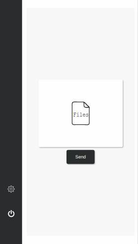
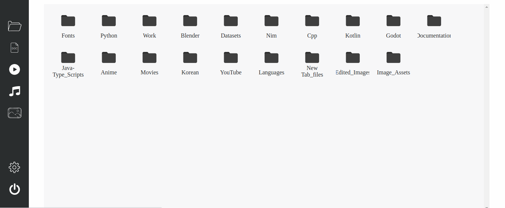

# Nshare

File sharing webapp

# Screenshots

#### Mobile example


#### Desktop example


# Setting up

- compile by running ```nimble make in the project root directory```
- navigate to the bin directory
- change the parameters in the settings.json file to change the app's settings
- run the nshare executable in the bin directory to start the app